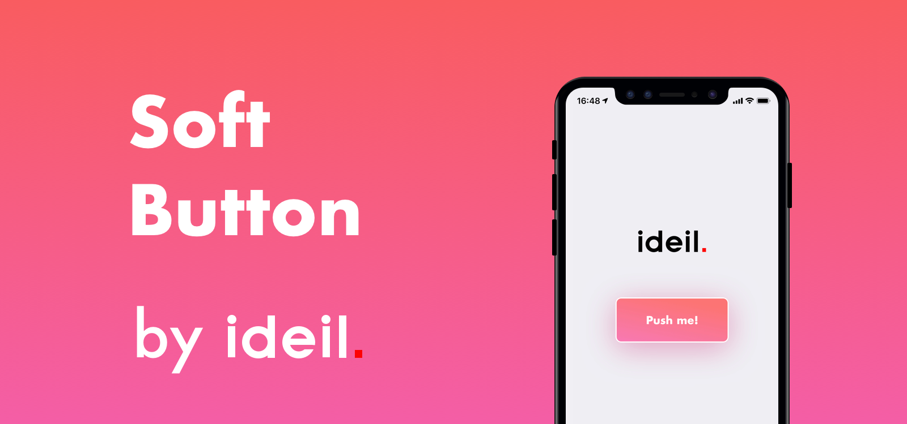

# SoftButton by [ideil.](https://www.ideil.com)

<p align="center">
    
</p>

<p align="center">


</p>

**SoftButton** makes it easy to add responsive cushy buttons to your iOS app! 
It's a `UIButton` subclass that lets you configure its style and behavior right in Storyboard.

## Installation

### Carthage

[Carthage](https://github.com/Carthage/Carthage) is a decentralized dependency manager that builds your dependencies and provides you with binary frameworks.

To integrate **SoftButton** into your Xcode project using Carthage, specify it in your `Cartfile`:

```ogdl
github "ideil/SoftButton" >= 1.0
```

Run `carthage update` to build the framework and drag the built `SoftButton.framework` into your Xcode project.

### Manually

Just download the project, and drag and drop the "SoftButton" folder in your project.

> If you have troubles displaying controls in Storyboard, add `@loader_path/../Frameworks` value to `Runpath Search Paths` of your target build setting.

## License

**SoftButton** is available under the MIT license. See the [LICENSE](https://github.com/ideil/SoftButton/blob/develop/LICENSE) file for more info.
